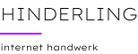

# CI/CD – Corporate Identity & Corporate Design

## Hinderling Internet Handwerk



---

## 1. Allgemeine Informationen

| Feld              | Wert                                          |
| ----------------- | --------------------------------------------- |
| **Firmenname**    | Hinderling Internet Handwerk                  |
| **Inhaber**       | Tobias Hinderling                             |
| **Adresse**       | Werkhofstrasse 11, 2503 Biel                  |
| **E-Mail**        | hallo@hinderling-internet-handwerk.ch         |
| **Telefon**       | 079 / 483'99'94                               |
| **Website**       | https://www.hinderling-internet-handwerk.ch   |

---

## 2. Markenkern & Positionierung

### Claim
> **unkompliziert – pragmatisch**

### Leitgedanke
Kleine Betriebe und Personen im Internet authentisch portraitieren. Einfache, funktionale Lösungen nach dem Motto *«Keep it simple»*.

### Kernwerte
- **Pragmatisch** – Lösungen, die einen Zweck erfüllen
- **Unkompliziert** – Keine unnötige Komplexität
- **Modern** – Zeitgemässe Technologien & Design
- **Datenschutz** – Hosting in der Schweiz / Europa bevorzugt

### Tonalität
- Nahbar, direkt, persönlich (Berndeutsch auf der Website: *«bruchsch ä nöii website?»*)
- Professionell, aber nicht steif
- Ehrlich und authentisch

---

## 3. Logo

### Primäres Logo


| Asset        | Datei                        | Verwendung               |
| ------------ | ---------------------------- | ------------------------ |
| **Logo**     | `assets/Logo5.png`           | Hauptlogo                |
| **Favicon**  | `assets/Favicon.png`         | Browser-Tab-Icon         |
| **Webclip**  | `assets/Webclip.png`         | Apple Touch Icon / Share |

### Regeln
- Das Logo wird immer auf dunklem Hintergrund (`--background-dark`) verwendet
- Ausreichend Freiraum um das Logo einhalten
- Keine Verzerrung, Rotation oder Farbveränderung

---

## 4. Farben

### Primärpalette

| Bezeichnung         | CSS-Variable           | HEX       | RGB              | Verwendung                     |
| ------------------- | ---------------------- | --------- | ---------------- | ------------------------------ |
| **Akzentfarbe**     | `--akzentfarbe`        | `#BD00FF` | `189, 0, 255`   | CTAs, Links, Highlights        |
| **Background Dark** | `--background-dark`    | `#1C0F21` | `28, 15, 33`    | Dunkle Sektionen, Footer       |
| **Text Dark**        | `--text-dark`          | `#202020` | `32, 32, 32`    | Fliesstext auf hellem Grund    |
| **Text Light**       | `--text-light`         | `#E9E9E9` | `233, 233, 233` | Fliesstext auf dunklem Grund   |

### Sekundärpalette

| Bezeichnung              | HEX       | Verwendung                         |
| ------------------------ | --------- | ---------------------------------- |
| **Weiss**                | `#FFFFFF` | Helle Hintergründe                 |
| **Schwarz**              | `#000000` | Reines Schwarz (sparsam einsetzen) |
| **Formular-Hintergrund** | `#37213F` | Input-Felder auf dunklem Grund     |
| **Container Grau**       | `#2A2A2A` | Container-Hintergründe             |
| **Input Grau**           | `#CFCFCF` | Formularfeld-Hintergrund hell      |

### Cookie-Banner-Farben

| Bezeichnung    | RGB              | Verwendung          |
| -------------- | ---------------- | ------------------- |
| **Background** | `26, 26, 46`     | Banner-Hintergrund  |
| **Primary**    | `189, 0, 255`    | Buttons & Links     |

---

## 5. Typografie

### Schriftart

| Schrift                  | Quelle        | Fallback                |
| ------------------------ | ------------- | ----------------------- |
| **Lexend Exa**           | Google Fonts  | `sans-serif`            |

```
font-family: "Lexend Exa", sans-serif;
```

### Schnitte (Gewichte)

| Gewicht | Bezeichnung  | Verwendung                          |
| ------- | ------------ | ----------------------------------- |
| 300     | Light        | Dekorative Elemente                 |
| 400     | Regular      | Fliesstext, Absätze                 |
| 500     | Medium       | Zitate, Zwischenüberschriften       |
| 600     | Semi-Bold    | Labels, Leads, Subtitles            |
| 700     | Bold         | Überschriften, Buttons              |

### Schriftgrössen

| Element            | Grösse   | Zeilenhöhe | Gewicht |
| ------------------ | -------- | ---------- | ------- |
| **H1 / Hero**      | 60px     | 68px       | 400     |
| **H2 / Heading**   | 24px     | 30px       | 700     |
| **H3 / Subheading**| 26px     | –          | 400     |
| **Zitat**          | 32px     | 48px       | 500     |
| **Body / Absatz**  | 16px     | 24px       | 400     |
| **Lead**           | 16px     | 24px       | 600     |
| **Small / Liste**  | 14px     | 21px       | 400     |
| **Button**         | –        | –          | 700     |

---

## 6. Design-Elemente

### Akzentlinie
Eine **5px hohe, 60px breite** Linie in der Akzentfarbe (`#BD00FF`) wird als visueller Trenner unter Überschriften eingesetzt.

```css
.akzentlinie {
  background-color: var(--akzentfarbe);
  width: 60px;
  height: 5px;
}
```

### Buttons

| Typ         | Hintergrund  | Textfarbe    | Border-Radius | Stil                  |
| ----------- | ------------ | ------------ | ------------- | --------------------- |
| **Primary** | `#BD00FF`    | `#FFFFFF`    | 0px           | Gefüllt               |
| **Ghost**   | transparent  | `#BD00FF`    | 5px           | 1.5px Border          |

### Links
- Farbe: `#BD00FF` (Akzentfarbe)
- Unterstrichen (`text-decoration: underline`)

### Bilder
- Profilbilder: **rund** (`border-radius: 150px`), 300×300px
- Aspektverhältnis Hero-Bilder: quadratisch (`aspect-ratio: 1`) mit 10px hellem Border
- Immer mit professioneller Fotografie arbeiten (Partner: Marcial Sommer, Martin Lustenberger)

---

## 7. Layout

| Eigenschaft            | Wert       |
| ---------------------- | ---------- |
| **Max. Seitenbreite**  | 1440px     |
| **Section Padding**    | 160px 80px (Desktop), 60px 40px (Tablet), 40px 20px (Mobile) |
| **Grid Gap**           | 80px (Desktop), 40–60px (Tablet), 30px (Mobile) |
| **Navbar**             | Fixed, heller Hintergrund, 20px 80px Padding |

### Breakpoints

| Breakpoint | Breite     |
| ---------- | ---------- |
| Desktop    | > 991px    |
| Tablet     | ≤ 991px    |
| Mobile L   | ≤ 767px    |
| Mobile S   | ≤ 479px    |

---

## 8. Dateien & Assets

```
assets/
├── Logo5.png        # Hauptlogo
├── Favicon.png      # Favicon (Browser-Tab)
└── Webclip.png      # Apple Touch Icon / Social Share
```

### Externe Ressourcen
- **Google Fonts:** https://fonts.googleapis.com/css2?family=Lexend+Exa:wght@300;400;500;600;700&display=swap
- **Website (Webflow):** https://www.hinderling-internet-handwerk.ch

---

*Stand: Juli 2025 · Hinderling Internet Handwerk, Biel*